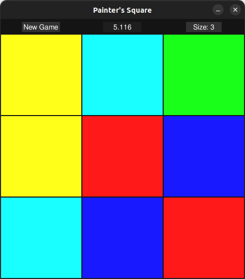
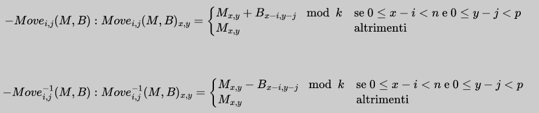
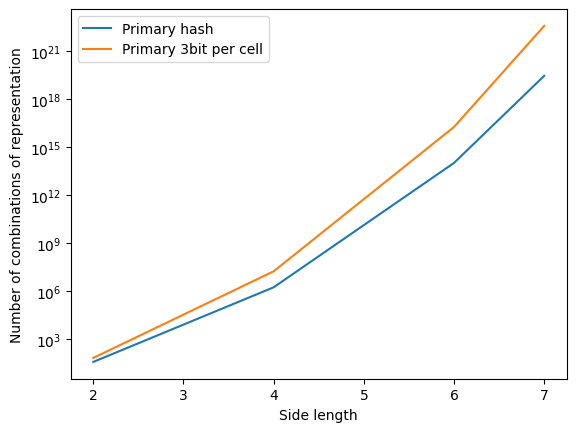
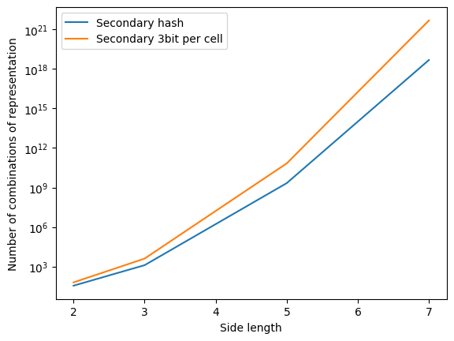
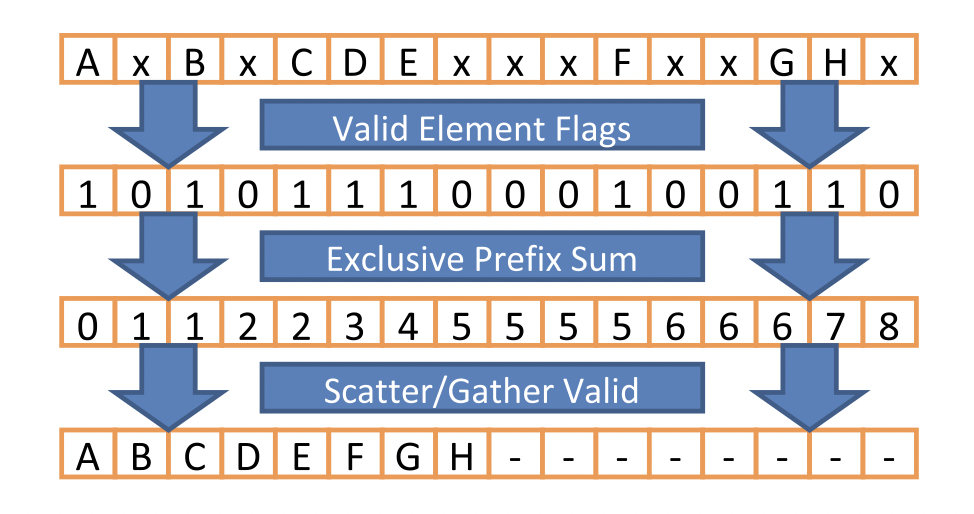
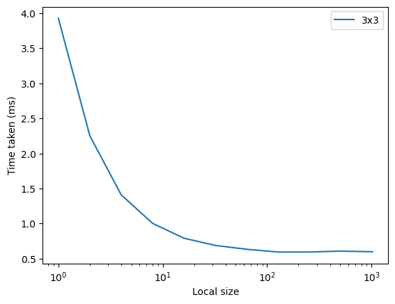
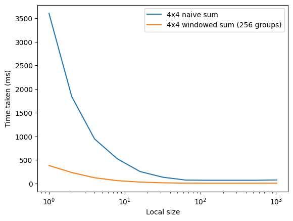

# Painter's square problem
Tabella dei contenuti:
- [1. Painter’s Square](#1)
    - [1.1. Definizione formale](#1.1)
    - [1.2. Versione analizzata](#1.2)
- [2. Soluzioni note](#2)
- [3. Metodo di induzione inversa per la risoluzione di giochi ad informazione completa](#3)
- [4. Baseline python](#4)
- [5. Port in OpenCl C e Parallelizzazione](#5)
    - [5.1. Generazione delle mosse con approccio semplice](#5.1)
    - [5.2. Compaction dei candidati dei candidati](#5.2)
        - [5.2.1. Generazione dei predicati](#5.2.1)
        - [5.2.2. Algoritmo di scan parallelo naive](#5.2.2)
        - [5.2.3. Algoritmo di scatter](#5.2.3)
    - [5.3. Primi risultati su 3x3](#5.3)
    - [5.4. Idea: sottovettorizzazione](#5.4)
    - [5.5. Algoritmo di scan parallelo con sliding window](#5.5)
- [6. Risultati su 4x4](#6)
    - [6.1. Considerazione sulla fattibilità per dimensioni maggiori](#6.1)
    - [6.2 Test sintetico di generazione delle mosse](#6.2)
- [7. Conclusioni](#8)

##

Appendice:
- [A.1. Implementazione sottovettorizzata di expand](#A.1)

***
### Nota all'interpretazione dei risultati
Tutti i tempi di esecuzione derivano da run eseguite sulla stessa macchina nelle stesse condizioni (nel limite del possibile), con specifiche riportate:

- CPU: AMD Ryzen 7 5800X
- GPU: Nvidia RTX 3080 OC
- RAM: 32GB DDR4 3200MHz

- Il sistema operativo è Ubuntu 20.04.2 LTS

- I driver sono aggiornati ad oggi (27 novembre 2023)
- La versione di gcc è 11.4.0.
- La versione di OpenCl è 3.0

***

## [1. Painter’s Square]<a name="1"></a>
Il painter’s square (originariamente “square puzzle”), è un puzzle a singolo giocatore, dove l’utente viene presentato con una griglia di quadrati colorati, il cui obiettivo è riportarli tutti ad uno stesso colore mediante un set di mosse note. Il puzzle è stato originariamente pensato ed implementato in una applet Scratch da Bruno Montalto, mio carissimo amico, nonchè collega di questo corso.

Le mosse possono essere effettuate su una qualsiasi casella, e cambiano il colore di alcune caselle (in base ad un pattern noto come “brush”) di una certa quantità.
In particolare, i colori che possono essere assunti da ogni casella sono univocamente associati ad un numero.  


### [1.1. Definizione formale]<a name="1.1"></a>
Più formalmente, il problema del painter’s square può essere descritto come:
Sia $D$ un sottoinsieme di $\mathbb{N}$ del tipo $[0, k-1]$ (inclusivo degli estremi).
Sia inoltre $M$ una matrice $m \times m$, con $M_{ij} \in D \space \forall i, j$ , ed una $B$ una matrice $n \times p$, dove $m, p <= n$

Definiamo la famiglia di funzioni:  


Più genericamente, noteremo una qualsiasi funzione di una di queste due famiglie come $Move_{i,j}^{\pm 1}(M, B)$, dove il segno di $\pm$ è determinato dal segno di $i$ e $j$.

Vogliamo trovare una sequenza di mosse $S = \{Move_{i_1, j_1}^{\pm 1}, Move_{i_2, j_2}^{\pm 1}, \dots, Move_{i_n, j_n}^{\pm 1}\}$ tale che $Move_{i_n, j_n}^{\pm 1} \circ \dots \circ Move_{i_2, j_2}^{\pm 1} \circ Move_{i_1, j_1}^{\pm 1}(M, B) = M'$, dove $M'$ è una matrice $m \times m$ con tutti gli elementi uguali.

### [1.2. Versione analizzata]<a name="1.2"></a>
Il problema originale è stato proposto con i seguenti parametri:
- $k = 6 \space \text{(numero di colori)}$
- $m = 3 \space \text{(dimensione della matrice)}$
- $B = \begin{bmatrix}
    1 & 0 & 1 \\\\
    0 & 1 & 0 \\\\
    1 & 0 & 1 \\\\
\end{bmatrix} \space \text{(brush)}$

Nel problema originale, inoltre, una soluzione era sempre garantita, in quanto la configurazione iniziale era ottenuta tramite una sequenza casuale di mosse.

In questa relazione, proponiamo i risulati sia per la versione originale, che per una versione con $m = 4$.

***

## [2. Soluzioni note]<a name="2"></a>
Il problema del painter’s square è stato risolto in maniera per i parametri originali, nonchè per $m = 4$ ed $m = 5$ da me. In particolare, ho trovato degli algoritmi che permettono la risoluzione progressiva del puzzle. La lunghezza media delle soluzioni con suddetti algoritmi è di circa 20 mosse per $m = 3$, 43 per $m = 4$ e 124 per $m = 5$.

Questa soluzione, per quanto efficace nella pratica, non è ottimale, in quanto non è garantito (ed anzi è evidente) che la soluzione trovata sia la più breve possibile.

***

## [3. Metodo di induzione inversa per la risoluzione di giochi ad informazione completa]<a name="3"></a>
L'induzione inversa è un processo nel quale si cerca di risolvere un problema partendo dalla sua configurazione finale per determinare una sequenza di operazioni ottimali che la collegano ad una configurazione iniziale.

Questo metodo è stato applicato con successo alla risoluzione di giochi ad informazione completa, come ad esempio la dama italiana, o gli scacchi fino a 7 pezzi.

Nel nostro caso, il metodo di soluzione inversa usa come posizione finale la matrice $M^0 = \begin{bmatrix}
    0 & 0 & ... & 0 \\\\
    0 & 0 & ... & 0 \\\\
    ... & ... & ... & ... \\\\
    0 & 0 & ... & 0 \\\\
\end{bmatrix}$. 
Possiamo quindi determinare una procedura $expand(M)$ che, data una matrice $M$, restituisce tutte le possibili configurazioni che possono essere raggiunte da $M$ in esattamente una mossa.

***

## [4. Baseline python]<a name="4"></a>
Una prima versione del risolutore è stata scritta in python, originariamente usando doppie liste per rappresentare le matrici, e successivamente usando numpy.
Il sorgente per queste versioni è disponibile nella repository del progetto.

Il risolutore python ha permesso di rispondere per la prima volta a diverse domande, tra le quali, notevoli:
- E' ogni configurazione raggiungibile? (No, solo $\frac{1}{9}$ delle configurazioni sono raggiungibili nel caso $m = 3$, $\frac{1}{1296}$ nel caso $m = 4$ e $\frac{1}{144}$ nel caso $m = 5$)
- Data $M^0$ come posizione iniziale, è possibile raggiungere $M^1$ in una mossa? (Solo nel caso $m = 5$)

La pipeline CPU è estremamente semplice, e consiste in:
- All'inizio, partiamo dalla posizione finale $M^0$, e generiamo tutte le posizioni raggiungibili in una mossa, che chiameremo $M^1$.
- Aggiungiamo $M^1$ alla lista delle posizioni raggiunte $M^\*$, assieme ad $M^0$. D'ora in poi, ogni volta che generiamo una posizione già esistente in $M^*$, la scartiamo.
- Ripetiamo il processo per ogni posizione in $M^1$, generando $M^2$, e aggiungendolo a $M^*$.
- Continuiamo fino per tutti i vari $M^n$. Ci fermiamo quando $M^n \subseteq M^\*$, ovvero quando non abbiamo più posizioni da generare.

Questo approccio ci garantisce che ogni posizione raggiungibile sia generata esattamente una volta (ed in particolare, che venga generata nel numero minimo di mosse), e che non vengano generate posizioni non raggiungibili.

Sebbene però il risolutore del $3 \times 3$ impieghi 0.21 secondi per trovare una soluzione, il risolutore per il $4 \times 4$ impiega 21 secondi, il risolutore per il $5 \times 5$ impiega ben oltre 11 ore, e non è stato possibile testare il risolutore per il $6 \times 6$.

***

## [5. Port in OpenCl C e Parallelizzazione]<a name="5"></a>
Si è quindi deciso di portare il risolutore in OpenCl C, per poter sfruttare le GPU moderne per la risoluzione del problema.
Questo pone la sfida di ridisegnare lo step di generazione delle mosse, che sarebbe stato estremamente inefficiente su un architettura parallela.  
Inoltre, sebbene l'approccio seriale sia lento, esso presenta il vantaggio di non dover gestire molteplici thread, e quindi di non dover gestire la sincronizzazione o la concorrenza.

Per prima cosa, scegliamo di dividere la matrice in due parti, corrispondenti alle due griglie. Questo è possibile in quanto, per il brush scelto, ogni cella della matrice dipende solo dalle celle della stessa griglia.

In questo modo, possiamo rappresentare la configurazione di una delle due griglie con un numero univoco $id = \sum_{i=0}^{m^2-1} M_{i} \cdot 8^i$, dove $M_i$ è il colore della cella $i$-esima della griglia.  
La scelta del numero 8 è dovuta alla rappresentazione binaria intrinseca: usiamo 3 bit per ogni cella, che ci permette, anche se con un certo spreco di memoria, di implementare operazioni molto più efficienti.  
Chiameremo inoltre griglia principale la griglia con numero di celle maggiore, e griglia secondaria la griglia con numero di celle minore. Notiamo che questa distinzione è necessaria solo per $m$ dispari, dove le due griglie hanno $\lceil\frac{m^2}{2}\rceil$ e $\lfloor\frac{m^2}{2}\rfloor$ celle.

### [5.1. Generazione delle mosse con approccio semplice]<a name="5.1"></a>
Per prima cosa, ridisegniamo l'operazione di mossa.
In particolare, nella versione seriale, la mossa è implementata come una somma tra matrice e brush, seguita da una operazione modulo.
Questo è, ovviamente, estremamente inefficiente, in quanto la maggior parte delle celle non viene modificata dalla mossa, e quindi non è necessario calcolare la somma.  
Per ovviare a ciò, notiamo che ogni possibile mossa è una combinazione di alcune caselle prese dalla configurazione precedente, ed altre dalla configurazione $Move^{\pm 1}(M, B)$.

Otteniamo quindi due posizioni intermedie, $M^-$ e $M^+$. Ad esempio, nella kernel di generazione delle mosse `expand` senza subvettorizzazione (vedi #5.2), abbiamo il seguente codice:
```c
// Get current item to expand
unsigned int hash = workload[i];

// Separate the bitgroups
unsigned char o[8] = {hash & 0x7, (hash >> 3) & 0x7, (hash >> 6) & 0x7, (hash >> 9) & 0x7, (hash >> 12) & 0x7, (hash >> 15) & 0x7, (hash >> 18) & 0x7, (hash >> 21) & 0x7};
unsigned char a[8] = {(o[0] + 1) % 6, (o[1] + 1) % 6, (o[2] + 1) % 6, (o[3] + 1) % 6, (o[4] + 1) % 6, (o[5] + 1) % 6, (o[6] + 1) % 6, (o[7] + 1) % 6};
unsigned char s[8] = {(o[0] + 5) % 6, (o[1] + 5) % 6, (o[2] + 5) % 6, (o[3] + 5) % 6, (o[4] + 5) % 6, (o[5] + 5) % 6, (o[6] + 5) % 6, (o[7] + 5) % 6};
```

A questo punto, possiamo combinare elementi di `a` e `s` per ottenere le due posizioni intermedie.  
Inoltre, due posizioni potrebbero generare la stessa posizione intermedia.   
Per evitare di produrre duplicati, ci assicuriamo di scrivere la posizione generata $m$ nella posizione $m$-esima del vettore di output (sempre controllando che $m$ non sia già stato generata in iterazioni precedenti), il che fa in modo che, anche nel caso in cui si verificasse una race condition, il risultato sarebbe comunque corretto.  
Peraltro a noi non interessa trovare ogni possibile soluzione ottimale, ma una sola qualsiasi.

Questo però vuol dire che, a differenza della baseline python, che teneva uno stack delle posizioni da espandere al passo successivo, i nostri candidati potrebbero contenere elementi vuoti. Risulta quindi necessario un passo di compaction, che verrà trattato in (#6.3).

### [5.2. Compaction dei candidati dei candidati]<a name="5.2"></a>
Come detto in (#5.1), la generazione delle mosse può lasciare elementi nulli, che vogliamo eliminare. Questo è necessario perchè non vogliamo lanciare kernel su elementi nulli, in quanto ciò porterebbe ad un notevole spreco di risorse computazionali. Inoltre, visto la nostra rappresentazione con 8 bit per cella, il numero di elementi sale estremamente velocemente:  




Questo vuol dire che, anche se in una iterazione ideale ed incredibilmente efficiente si generassero tutte le possibili posizioni (raggiungibili o meno (!)), l'array che le contiene sarebbe comunque estremamente sparso, e quindi inefficiente da processare, a meno che non facciamo uso di un'opportuna tecnica di compaction.

L'operazione di compaction prende in input un vettore di elementi e ne restituisce un altro contenente solo gli elementi che rispettano una certa condizione imposta (nel nostro caso, tutti gli elementi non-zero).

L'implementazione dell'operazione di compaction seriale è molto semplice, con complessità $O(n)$.
Noi però vogliamo parallelizzare l'operazione, e quindi dobbiamo trovare un modo per farlo in maniera efficiente.
L'operazione di compaction parallela è fatta di 3 fasi:
- Generazione dei predicati. In questa fase creiamo un vettore che contiene 1 se l'elemento corrispondente del vettore di input rispetta la condizione, 0 altrimenti.
- Algoritmo di scan parallelo. In questa fase, generiamo un vettore che contiene, per ogni elemento, la somma di tutti gli elementi precedenti. Applicandolo al vettore dei predicati, otteniamo un vettore che contiene, per ogni elemento, il numero di elementi precedenti che rispettano la condizione. In altre parole, otteniamo la posizione in cui l'elemento (se non nullo) dovrebbe finire nel vettore di output.
- Algoritmo di scatter. In questa fase, generiamo il vettore di output, copiando ogni elemento del vettore di input nella posizione corrispondente del vettore di output, secondo il vettore di scan.



#### [5.2.1. Generazione dei predicati]<a name="5.2.1"></a>
Come già detto prima, nel nostro caso vogliamo isolare tutti gli elementi non-nulli. Per fare ciò, possiamo usare un semplice predicato, che scrive nell'output 1 se l'elemento è non-zero. In OpenCl C, questo si traduce in:

```c
// The predicate kernel
void kernel predicate_neq0(global const int * restrict input, global unsigned int * restrict output, int nels) {
    int i = get_global_id(0);
    if (i >= nels) return;
    output[i] = input[i] != 0;
}
```

#### [5.2.2. Algoritmo di scan parallelo naive]<a name="5.2.2"></a>
In prima battuta, decidiamo di implementare un algoritmo di scan parallelo naive (Hillis and Steele).  
Per quanto semplice, questo algoritmo permette comunque di ottenere un buono speedup (rispetto ad una versione seriale), e di ottenere un buon punto di partenza per successive ottimizzazioni.  
In particolare, l'algoritmo di scan parallelo naive costruisce un albero di scan denso, che costruisce in $O(\log n)$ passi, e quindi ha complessità $O(n \log n)$.  
Questo vuol dire che, fino a quando $n$ è minore del numero di thread che riusciamo a lanciare in parallelo, l'algoritmo di scan parallelo naive ha complessitù $O(\log n)$  


Un passo di scan parallelo naive è implementato in OpenCl C come segue:
```c
kernel void step_naive_prefix_sum(global unsigned int* a, global unsigned int* b, int offset, int nels)
{
    int i = get_global_id(0);
    if (i >= nels) return;
    b[i] = a[i];
    if (i >= offset) {
        b[i] += a[i - offset];
    }
}
```

#### [5.2.3. Algoritmo di scatter]<a name="5.2.3"></a>
L'algoritmo di scatter è molto semplice, e consiste semplicemente nel copiare ogni elemento del vettore di input nella posizione corrispondente del vettore di output, secondo il vettore di scan. Ovviamente, questo avviene se e solo se il predicato è vero.
```c
kernel void scatter(global const unsigned int * scouted_positions, global const unsigned int * predicates, global unsigned int * idx_sums, global unsigned int * new_payload, int nels) {
    int i = get_global_id(0);
    if (i >= nels) return;
    if (predicates[i]) {
        new_payload[idx_sums[i]] = scouted_positions[i];
    }
}
```

### [5.3. Primi risultati su 3x3]<a name="5.3"></a>
```
== Primary Time stats ==            == Secondary Time stats ==
Expand: 0.046848 ms                 Expand: 0.031904 ms
Predicate: 0.031456 ms              Predicate: 0.023296 ms
Prefix sum: 0.492160 ms             Prefix sum: 0.292096 ms
Scatter: 0.031744 ms                Scatter: 0.027328 ms
Total: 0.602208 ms                  Total: 0.374624 ms
========================            ==========================
```

Segue un grafico che mostra i tempi (primari) al variare del local work size.  


I risultati sono sicuramente molto incoraggianti, per due motivi:
- Chiaramente, il tempo di esecuzione è molto inferiore a quello della baseline python (0.21 secondi)
- Il tempo di esecuzione è dominato dall'algoritmo di scan parallelo, il che vuol dire che, se riuscissimo a migliorare l'algoritmo di scan, potremmo ottenere un notevole speedup.

### [5.4. Idea: sottovettorizzazione]<a name="5.4"></a>
Un idea interessante che ho avuto per cercare di migliorare l'algoritmo di expand è quella di sottovettorizzare.

Ma cosa intendiamo con sottovettorizzazione?

Visto che ogni posizione è in realtà la concatenazione di 3-bit per ogni cella, possiamo immaginare che spaccare l'hash nei varii bit-group, aggiungere, modulare e ricombinare sia un'operazione possibilmente problematica all'aumentare della dimensione della matrice. Ricordiamo infatti che, per $m = 5$, abbiamo 13 celle nella griglia principale, e 12 celle nella griglia secondaria, quindi l'expand di una griglia principale richiederebbe svariate operazioni solo per spacchettare e ricombinare l'hash.

Per ovviare a ciò, propongo un nuovo tipo di operazione, che chiameremo operazione bit-raggruppata, che permette di eseguire operazioni su bit-group, senza modificare gli altri bit-group, eliminando quindi la necessità di spacchettare e ricombinare l'hash.

In particolare, mostriamo dopo l'implementazione di incremento e decremento modulare in bit-group, che sono le operazioni che ci interessano.

### [5.5. Algoritmo di scan parallelo con sliding window]<a name="5.5"></a>
E' quindi arrivato il momento di implementare un algoritmo di scan parallelo più efficiente. 
In particolare, si è scelto di implementare l'algoritmo di scan parallelo con sliding window, tema trattato a lezione. Questo permette di diminuire notevolmente la complessità dell'algoritmo nella maniera seguente:
- Dividiamo il vettore in blocchi di dimensione $b$.
- Per ogni blocco, calcoliamo il vettore di scan del blocco. Questo può essere fatto con un algoritmo di scan parallelo naive. In particolare, avendo ridotto il numero di elementi considerevolmente, l'algoritmo naive torna ad essere efficiente.
- Una volta che otteniamo i valori di scan per ogni blocco, possiamo a loro volta calcolare il vettore di scan dei blocchi. Questo può essere fatto con un algoritmo di scan parallelo naive.
- Una volta ottenuto questo vettore (chiamato tails), possiamo aggiungere ad ogni blocco la tail del blocco precedente.

## [6. Risultati su 4x4]<a name="6"></a>
Di seguito un grafico che mostra i tempi di esecuzione al variare del local work size.  


Inutile dire che l'approccio windowed è molto più efficiente. Inoltre, questa ottimizzazione porta la distribuzione dei tempi di esecuzione ad essere molto più uniforme, il che vuol dire che in futuro può valere la pena di ottimizzare altri step della pipeline, come possiamo vedere in questi dati (ottenuti con local work size = groups = 256):

```
===== Timings =====
Expand: 0.144064ms
Predicate: 2.62589ms
Main scan: 2.71299ms
Tails scan: 0.06032ms
Fixup: 2.68688ms
Scatter: 1.34218ms
Total time: 9.57232ms
===== End Timings =====
```

### [6.1. Considerazione sulla fattibilità per dimensioni maggiori]<a name="6.1"></a>
Per quanto i risultati ottenuti siano incoraggianti, è necessario fare alcune considerazioni sulla fattibilità di questo approccio per dimensioni maggiori.
Per prima cosa, bisogna abbandonare l'idea di usare un vettore nextpayload con corrispondenza 1:1 con le posizioni (per quanto discusso in #5.2).
Invece, potremmo fare scrivere ad ogni thread in uno slot dedicato, e fare un operazione di compaction ad ogni generazione di singolo tipo di mossa. Ovviamente, si tratta di un trade-off tra memoria e tempo di esecuzione, ma è necessario per poter procedere oltre.  
Inoltre, è necessario riuscire a trovare un modo per codificare rotazioni e flip di una posizione con lo stesso hash. Questo è necessario per poter ridurre il numero di posizioni da generare di un fattore 8, e quindi ridurre il tempo di esecuzione (fino a 8 volte).
Infine, se si riuscisse ad applicare il concetto di sottovettorizzazione in base 6, si potrebbe ridurre il numero di hash possibili al minimo possibile.

### [6.2 Test sintetico di generazione delle mosse]<a name="6.2"></a>
Per testare qualora la generazione con sottovettorizzazione possa essere effettivamente più efficiente, ho scritto un test sintetico che chiama il kernel di generazione delle mosse su un payload finto molto grande:
```
// Subword vectorization
4194304 0.250880 
8388608 0.496640 
16777216 0.946176

// Normal
4194304 0.248960 
8388608 0.494592 
16777216 0.947200
```
Questo mostra che, almeno nel 4x4, la sottovettorizzazione non porta ad un miglioramento misurabile delle prestazioni.
Possiamo però aspettarci che, all'aumentare della dimensione della matrice, la sottovettorizzazione diventi sempre più vantaggiosa.
Infatti l'operazione di spacchettamento e ricombinazione diventa sempre più costosa all'aumentare della dimensione della matrice, mentre l'operazione di sottovettorizzazione rimane costante.

## [7. Conclusioni]<a name="7"></a>
In conclusione, in questa relazione abbiamo:
- Dato una definizione formale al problema del Painter's Square
- Descritto un metodo di induzione inversa per la risoluzione di giochi ad informazione completa
- Mostrato una semplice implementazione del risolutore per il $3 \times 3$ e $4 \times 4$, migliorando di molto i tempi della baseline python grazie alla parallelizzazione
- Migliorato drasticamente il risultato del punto precedente, implementando un algoritmo di scan parallelo con sliding window
- Descritto un'idea per migliorare ulteriormente le prestazioni, che però non ha portato ad un miglioramento misurabile delle prestazioni

***

## [A.1. Implementazione sottovettorizzata di expand]<a name="A.1"></a>
```c
void kernel expand_subvec(global unsigned int * restrict parent_table, global const unsigned int * workload, global unsigned int * next_workload, unsigned int workload_size) {
    int i = get_global_id(0);
    if (i >= workload_size) return;
    // Get current item to expand
    unsigned int hash = workload[i];

    // Calculate the add1 position
    unsigned int add1 = hash + M3;
    //k = (add1 >> 1) & add1; // We can remove the & M2 because we know that there are no 111 as result  of add1, since we remove 110 immediately with this op
    add1 = add1 ^ (add1 & ((add1 >> 1) | (add1 << 1))); // add1 = (add1 - ((k << 1)|k)) can be simplified to this

    // Write the results. We both need to set the position's parent to the current position, and add it to the next workload
    for (int i = 0; i < 16; i++) {
        unsigned int m =    ((i & 0x7) == 0) * ((add1 & PMOVE1MASK) | (hash & NPMOVE1MASK)) +
                            ((i & 0x7) == 1) * ((add1 & PMOVE2MASK) | (hash & NPMOVE2MASK)) +
                            ((i & 0x7) == 2) * ((add1 & PMOVE3MASK) | (hash & NPMOVE3MASK)) +
                            ((i & 0x7) == 3) * ((add1 & PMOVE4MASK) | (hash & NPMOVE4MASK)) +
                            ((i & 0x7) == 4) * ((add1 & PMOVE5MASK) | (hash & NPMOVE5MASK)) +
                            ((i & 0x7) == 5) * ((add1 & PMOVE6MASK) | (hash & NPMOVE6MASK)) +
                            ((i & 0x7) == 6) * ((add1 & PMOVE7MASK) | (hash & NPMOVE7MASK)) +
                            ((i & 0x7) == 7) * ((add1 & PMOVE8MASK) | (hash & NPMOVE8MASK));
            add1 -= M2 * (i == 7);
        
        if (parent_table[m] == POSITION_TODISCOVER) {
            parent_table[m] = hash;
            next_workload[m] = m;
        }
    }
}
```

In questa implementazione, usiamo una maschera `M3` = 001001...001, che ci permette di derivare la posizione `add1` in maniera molto efficiente.
Inoltre, una volta ottenuta la rappresentazione binaria, possiamo derivare `sub1` in maniera molto efficiente, semplicemente sottraendo la maschera `M2` = 010010...010.
In particolare possiamo dimostrare che sussiste le due dipendenze seguenti.

- $add'= H + M_3 + G$
- $sub' = H - M_3 + G$

Sottraendo a membro a membro le due equazioni, otteniamo:

- $add' - sub' = 2 \cdot M_3$

Che è equivalente a:

- $add' - sub' = M_2$

Da cui segue $sub' = add' - M_2$.

Un area dove la sottovettorizzazione potrebbe essere interessante è quella di processori senza istruzioni SIMD. Infatti, l'operazione di spacchettamento e ricombinazione è molto costosa, e quindi potrebbe valere la pena di usare la sottovettorizzazione per evitare di doverla eseguire.
Inoltre, una visita rapida a https://compiler-explorer.com/ ci mostra che, almeno per il compilatore gcc e per la cpu, la sottovettorizzazione genera codice molto più corto. Questo potrebbe essere utile in ambienti embedded, dove la memoria è limitata.